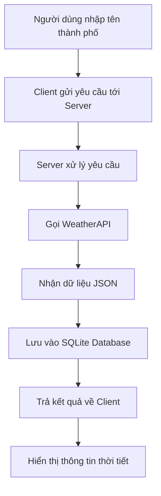

# Ứng dụng Tra cứu Thời tiết Online

<div align="center">
    <h2>
        <a href="https://dainam.edu.vn/vi/khoa-cong-nghe-thong-tin">
            🎓 Khoa Công nghệ Thông tin - Đại học Đại Nam
        </a>
    </h2>
    
    <p>
        
        
        
    </p>
    
    [](https://www.facebook.com/DNUAIoTLab)
    [](https://dainam.edu.vn/vi/khoa-cong-nghe-thong-tin)
    [](https://dainam.edu.vn)
    
</div>

---

## 1. Giới thiệu hệ thống

Hệ thống **Ứng dụng tra cứu thời tiết trực tuyến** được xây dựng theo mô hình **Client-Server** hiện đại, sử dụng công nghệ Java và SQLite để tạo ra một giải pháp toàn diện cho việc tra cứu thông tin thời tiết.

### 🎯 Mục tiêu dự án
- **Cung cấp thông tin thời tiết chính xác**: Hỗ trợ người dùng tra cứu thông tin thời tiết (nhiệt độ, độ ẩm, tình trạng nắng/mưa) theo thành phố một cách nhanh chóng và chính xác
- **Dữ liệu thời gian thực**: Cung cấp dữ liệu thời tiết theo thời gian thực từ API công khai WeatherAPI, đảm bảo thông tin luôn được cập nhật mới nhất
- **Quản lý lịch sử tra cứu**: Lưu trữ lịch sử tra cứu trong cơ sở dữ liệu SQLite để người dùng và quản trị viên có thể theo dõi và phân tích xu hướng tìm kiếm

### ✨ Điểm nổi bật
- **Giao diện thân thiện**: Người dùng có thể nhập tên thành phố và nhận thông tin thời tiết ngay lập tức thông qua giao diện đồ họa trực quan
- **Hỗ trợ đa thành phố**: Hệ thống hỗ trợ tra cứu thời tiết cho nhiều thành phố trên toàn thế giới với dữ liệu được cập nhật theo thời gian thực
- **Lưu trữ thông minh**: Tự động lưu lịch sử tìm kiếm để người dùng có thể tham khảo lại các thông tin đã tra cứu trước đó
- **Mục đích giáo dục**: Giao diện client đơn giản, dễ sử dụng, thuận tiện cho việc học tập và thực hành lập trình mạng, phù hợp với môi trường đại học

### 🏛️ Kiến trúc hệ thống
```
    Client Application (Java Swing)
              ↕ TCP/IP
        Server Application (Java)
              ↕ JDBC
         SQLite Database
              ↕ HTTP/API
          WeatherAPI Service
```

---

## 2. Công nghệ & Ngôn ngữ sử dụng

<div align="center">

[](https://www.java.com/)
[](https://www.sqlite.org/)
[](https://www.weatherapi.com/)
[]()
[](https://maven.apache.org/)

</div>

### 💻 Công nghệ Backend
- **Java SE 17+**: Ngôn ngữ lập trình chính cho cả client và server
  - Lập trình hướng đối tượng
  - Xử lý đa luồng cho server
  - Quản lý exception và logging
- **SQLite Database**: Hệ quản trị cơ sở dữ liệu nhúng
  - Lưu trữ lịch sử tra cứu
  - Quản lý thông tin người dùng
  - Thống kê dữ liệu tra cứu

### 🌐 Tích hợp API
- **WeatherAPI**: Dịch vụ API thời tiết công khai
  - Cung cấp dữ liệu thời tiết thời gian thực
  - Hỗ trợ tra cứu theo tên thành phố
  - Format dữ liệu JSON dễ xử lý
- **HTTP Client**: Java built-in HTTP client cho API calls
- **JSON Processing**: Xử lý và parse dữ liệu JSON từ API

### 🎨 Công nghệ Frontend
- **Java Swing**: Framework GUI cho ứng dụng client
  - Giao diện desktop native
  - Components phong phú và linh hoạt
  - Event-driven programming
- **Custom UI Components**: Thiết kế giao diện người dùng tùy chỉnh

### 🛠️ Công cụ phát triển
- **Maven**: Build automation và dependency management
- **JUnit 5**: Framework testing cho unit tests
- **Java Logging API**: Hệ thống logging và monitoring
- **JDBC**: Kết nối và thao tác cơ sở dữ liệu

---

## 3. Một số hình ảnh

### 🖥️ Giao diện chính của ứng dụng

*Giao diện chính với ô tìm kiếm thành phố và khu vực hiển thị kết quả*

### 🌤️ Hiển thị thông tin thời tiết

*Hiển thị chi tiết thông tin thời tiết: nhiệt độ, độ ẩm, tình trạng thời tiết và biểu tượng*

### 📊 Lịch sử tra cứu

*Bảng lịch sử tra cứu với thông tin thời gian, thành phố và kết quả*

### ⚙️ Giao diện quản trị

*Panel quản trị với thống kê hệ thống và quản lý dữ liệu*

### 📱 Responsive Design
<div align="center">


</div>
*Giao diện tương thích với nhiều kích thước màn hình*

### 🔄 Luồng hoạt động hệ thống


---

## 4. Các bước cài đặt

### 📋 Yêu cầu hệ thống

**Phần mềm bắt buộc:**
```bash
# Kiểm tra Java (yêu cầu phiên bản 17 trở lên)
java --version
javac --version

# Kiểm tra Maven (tùy chọn, khuyến nghị)
mvn --version

# Kiểm tra kết nối internet để truy cập WeatherAPI
ping api.weatherapi.com
```

**Cấu hình tối thiểu:**
- **RAM**: 512MB trở lên
- **Ổ cứng**: 100MB dung lượng trống
- **Hệ điều hành**: Windows 10+, macOS 10.14+, Linux Ubuntu 18.04+
- **Kết nối mạng**: Cần thiết để truy cập WeatherAPI

### 🚀 Hướng dẫn cài đặt từng bước

#### Bước 1: Tải và chuẩn bị mã nguồn
```bash
# Clone repository từ GitHub
git clone https://github.com/your-username/weather-lookup-app.git

# Di chuyển vào thư mục dự án
cd weather-lookup-app

# Kiểm tra cấu trúc thư mục
ls -la
```

#### Bước 2: Cấu hình API Key
```bash
# Tạo file cấu hình từ template
cp config/config.example.properties config/config.properties

# Chỉnh sửa file cấu hình
nano config/config.properties
```

**Nội dung file `config.properties`:**
```properties
# Cấu hình WeatherAPI
WEATHER_API_KEY=your_weatherapi_key_here
WEATHER_API_BASE_URL=http://api.weatherapi.com/v1
WEATHER_API_TIMEOUT=5000

# Cấu hình Database
DATABASE_PATH=data/weather.db
DATABASE_INIT_SCRIPT=sql/init.sql

# Cấu hình Server
SERVER_PORT=8080
SERVER_MAX_CONNECTIONS=50
SERVER_TIMEOUT=30000
```

#### Bước 3: Cài đặt dependencies và build
```bash
# Sử dụng Maven (khuyến nghị)
mvn clean install

# Hoặc compile thủ công
mkdir -p build/classes
javac -cp "lib/*:." -d build/classes src/**/*.java
```

#### Bước 4: Khởi tạo cơ sở dữ liệu
```bash
# Tạo thư mục data nếu chưa có
mkdir -p data

# Chạy script khởi tạo database
java -cp "build/classes:lib/*" com.weatherapp.setup.DatabaseInitializer

# Kiểm tra database đã được tạo
ls -la data/weather.db
```

#### Bước 5: Chạy ứng dụng
```bash
# Terminal 1: Khởi động Server
java -cp "build/classes:lib/*" com.weatherapp.server.WeatherServer

# Terminal 2: Khởi động Client
java -cp "build/classes:lib/*" com.weatherapp.client.WeatherClient
```

### 🔧 Cấu hình nâng cao

#### Tùy chỉnh logging
```properties
# Trong file logging.properties
handlers=java.util.logging.FileHandler,java.util.logging.ConsoleHandler
java.util.logging.FileHandler.pattern=logs/weather-app-%g.log
java.util.logging.FileHandler.limit=1000000
java.util.logging.FileHandler.count=5
```

#### Cấu hình proxy (nếu cần)
```properties
# Trong config.properties
HTTP_PROXY_HOST=proxy.company.com
HTTP_PROXY_PORT=8080
HTTP_PROXY_USERNAME=username
HTTP_PROXY_PASSWORD=password
```

### 🐳 Cài đặt bằng Docker (tùy chọn)
```dockerfile
# Dockerfile
FROM openjdk:17-jdk-slim

COPY . /app
WORKDIR /app

RUN mvn clean package
EXPOSE 8080

CMD ["java", "-jar", "target/weather-app.jar"]
```

```bash
# Build và chạy Docker container
docker build -t weather-app .
docker run -p 8080:8080 weather-app
```

---

## 5. Liên hệ

<div align="center">

### 👨‍💻 Thông tin liên hệ chính

**Nguyễn Nguyễn**  
*Sinh viên Khoa Công nghệ Thông tin*

📧 **Email chính**: [nguyennguyenvh09@gmail.com](mailto:nguyennguyenvh09@gmail.com)  
📱 **Điện thoại**: +84 XXX-XXX-XXX  
💬 **Zalo/WhatsApp**: +84 XXX-XXX-XXX  

---

### 🏛️ Thông tin học thuật

🎓 **Khoa**: [Công nghệ Thông tin](https://dainam.edu.vn/vi/khoa-cong-nghe-thong-tin)  
🏫 **Trường**: [Đại học Đại Nam](https://dainam.edu.vn)  
🔬 **Phòng thí nghiệm**: [AIoTLab](https://www.facebook.com/DNUAIoTLab)  
📍 **Địa chỉ**: Km29, Đại lộ Thăng Long, Nghĩa Trụ, Văn Giang, Hưng Yên

---

### 🌐 Liên kết xã hội & học thuật

[](https://facebook.com/your-profile)
[](https://linkedin.com/in/your-profile)
[](https://github.com/your-username)
[](https://www.facebook.com/DNUAIoTLab)

---

### 📞 Hỗ trợ kỹ thuật

**Thời gian hỗ trợ**: Thứ 2 - Thứ 6, 8:00 - 17:00 (GMT+7)

📧 **Email hỗ trợ**: [support.weather@dainam.edu.vn](mailto:support.weather@dainam.edu.vn)  
🎫 **Tạo issue**: [GitHub Issues](https://github.com/your-username/weather-lookup-app/issues)  
📖 **Wiki & Documentation**: [GitHub Wiki](https://github.com/your-username/weather-lookup-app/wiki)  

---

### 🤝 Đóng góp và hợp tác

Chúng tôi hoan nghênh mọi đóng góp từ cộng đồng:

- 🐛 **Báo lỗi**: Tạo issue trên GitHub với mô tả chi tiết
- 💡 **Đề xuất tính năng**: Thảo luận trong GitHub Discussions  
- 🔧 **Pull Request**: Fork repo và tạo PR theo hướng dẫn
- 📚 **Cải thiện tài liệu**: Giúp hoàn thiện documentation

**Quy tắc đóng góp**:
- Tuân thủ coding standards của Java
- Viết unit tests cho code mới
- Cập nhật documentation khi cần thiết
- Sử dụng commit message có ý nghĩa

---

</div>

**Được phát triển với ❤️ tại Khoa Công nghệ Thông tin - Đại học Đại Nam**


